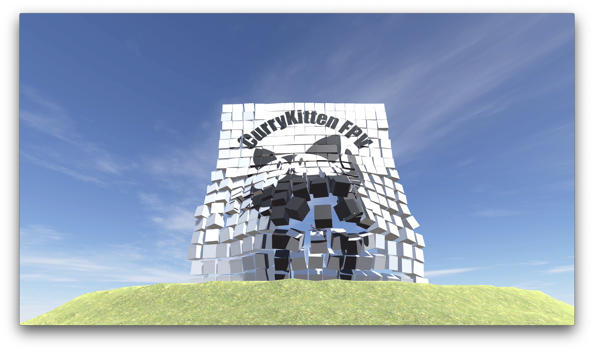

# CurryKitten FPV Simulator

Welcome to my FPV simulator project.  One important thing to point out is that this isn't an open source project, but GitHub is being used for defect tracking, binary distribution and wiki hosting.  The Sim is also available on Steam here https://store.steampowered.com/app/1331330/CurryKitten_FPV_Simulator/

The  wiki pages are super helpful, and should be your first port of call for any issues.  They should be able to walk you through hooking up a controller and how to do everything you need to get going.  Check it out here https://github.com/CurryKitten/CurryKitten-Sim/wiki

Aside from posting the releases here in GitHub, I make a video going into the details of of the changes/new features on my YouTube channel here http://www.youtube.com/currykitten You can check out the latest update video can be found at the top of the playlist here https://www.youtube.com/playlist?list=PL7WaECFssECJDaRhrjxLNkfFRT_K3jxqT 

Made possible throuh the support of my kind Patreon supporters.  You can find my page here https://www.patreon.com/CurryKitten
